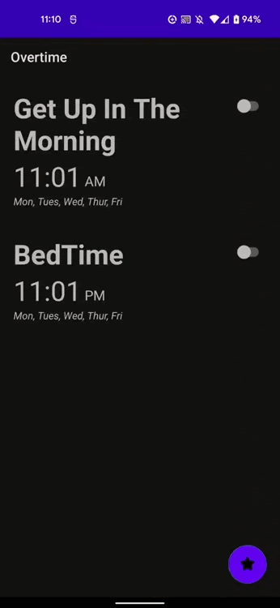
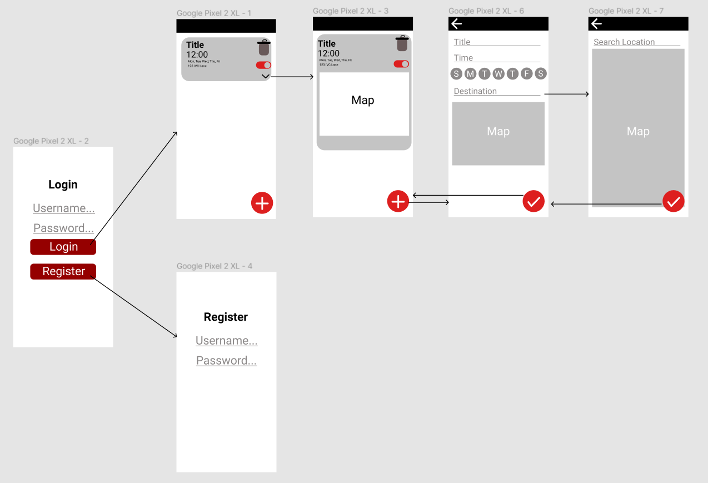

Original App Design Project
===

# Overtime

## Table of Contents
1. [Overview](#Overview)
1. [Product Spec](#Product-Spec)
1. [Wireframes](#Wireframes)
2. [Schema](#Schema)

## Overview
### Description
An alarm that adjusts times based on the location the user needs to arrive to. It measures the traffic and weather to determine the time the alarm sets off.  

### App Evaluation
[Evaluation of your app across the following attributes]
- **Category: Utility/Productivity**
- **Mobile: This app is solely intended for mobile users as most people utilize their phone as alarms**
- **Story: Analyzes specific traffic and weather conditions in order to determine the best time to set off the alarm**
- **Market: All sorts of individuals such as students and full-time workers.**
- **Habit: Most people who utilize alarms usually use it on a daily basis**
- **Scope: It would simple be a utility at first but possibly could expand to incorporate larger conditions other than weather and traffic**

## Product Spec

### 1. User Stories (Required and Optional)

**Required Must-have Stories**

- [x] Home (To allow user to view ListView with all the alarms)
- [x] Add Alarm (To allow user to input information and create an alarm)
- [x] Determine Destination (To allow user to use Google Maps to find their destination)

**Optional Nice-to-have Stories**

- [ ] Settings

### 2. Screen Archetypes

* Login
* Register - User can sign up and log into an account from here
* Alarms Screen
   * Should present a list of alarms which differ based on location
   * User should also be able to add and delete an alarm
   * ...
* Map Screen
   * Upon selecting the alarm the user should be prompted with a map under the alarm
* Map Edit Screen
   * The user should be able to add the destination through its name and set a time around where it should set off 


(Purple box will later be updated to be map)




### 3. Navigation

**Tab Navigation** (Tab to Screen)

* Home
* Add alarm

**Flow Navigation** (Screen to Screen)

* Alarm
   * Map
   * Map Edit
* Add alarm
   * New alarm set

## Wireframes
[Add picture of your hand sketched wireframes in this section]


### [BONUS] Digital Wireframes & Mockups

### [BONUS] Interactive Prototype

## Schema 

### Models
User's Alarm
| Properties | Type | Description|
| ------- | ------- | ----|
|userProfile| String | User's personal google account|
| title| String| Title of the alarm|
| time | Date | What time the user wants to get up|
| dayOfTheWeek| Date| What day of the week the user wants to wake up|
|map| Dictionary | The location the user wants to go to| 

### Networking
#### List of network requests by screen
   - Home Feed Screen
      - (Read/GET) The users alarms
         ```swift
         let query = PFQuery(className:"Alarm")
         query.whereKey("author", equalTo: currentUser)
         query.order(byDescending: "createdAt")
         query.findObjectsInBackground { (Alarm: [PFObject]?, error: Error?) in
            if let error = error { 
               print(error.localizedDescription)
            } else if let alarm = alarm {
               print("Successfully retrieved \(alarm.count) alarm.")
           // TODO: Do something with alarms...
            }
         }
         ```
      - (Create/ALARM) Create a Alarm
      - (Delete) Delete existing Alarm
      - (Create/ALARM) Edit Alarm
      - (Delete) cancel Edit Alarm
   - Create Alarm Screen
      - (Create/ALARM) Create a new Alarm object
   
- [OPTIONAL: List endpoints if using existing API such as Yelp]
